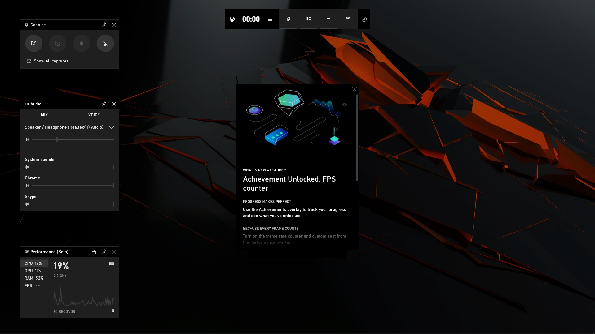
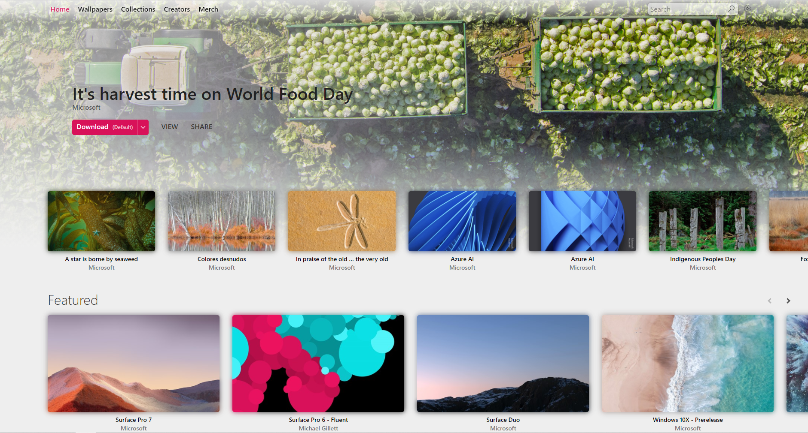
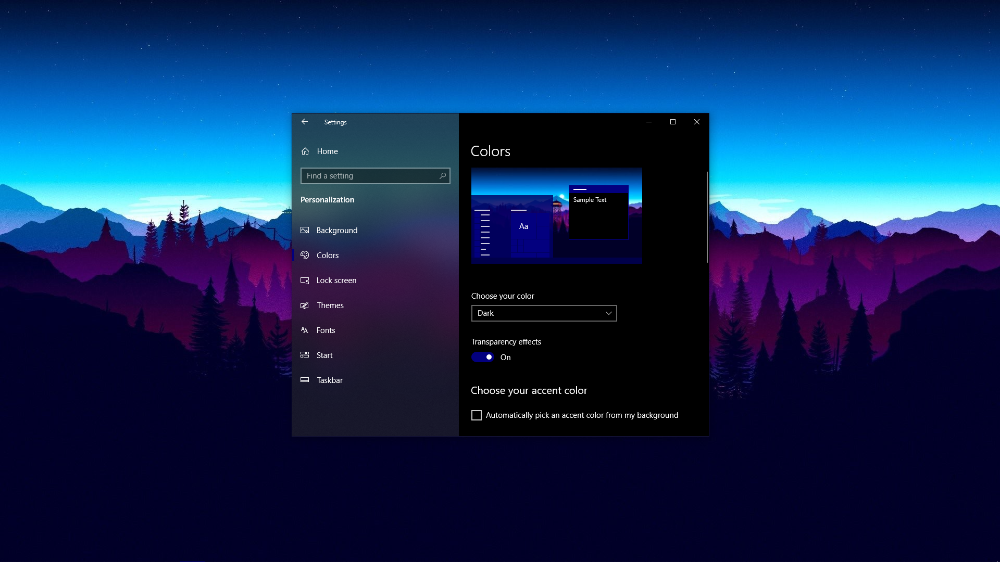
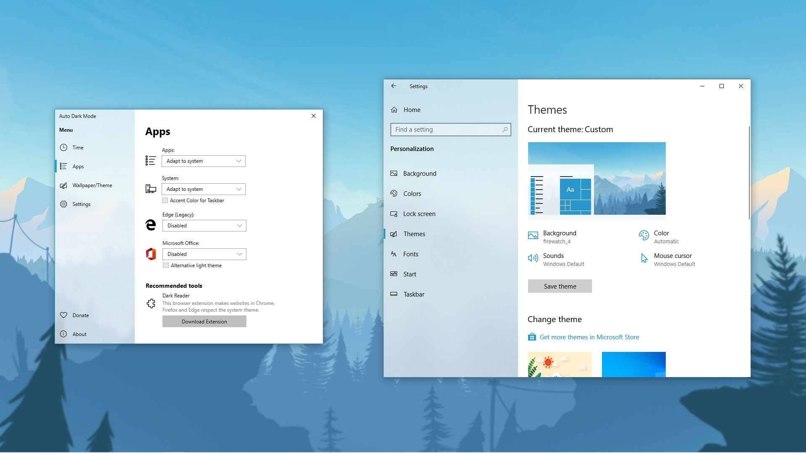
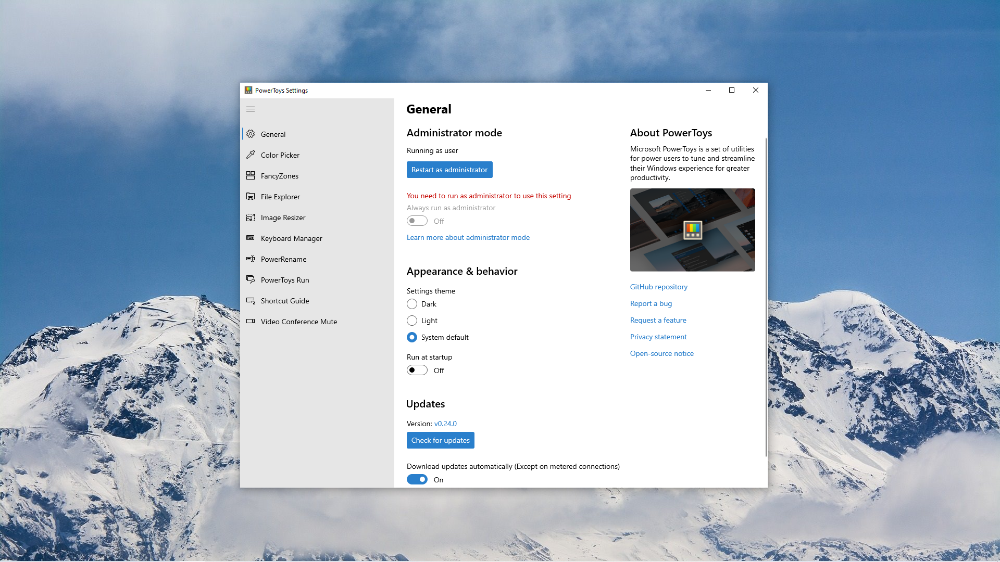
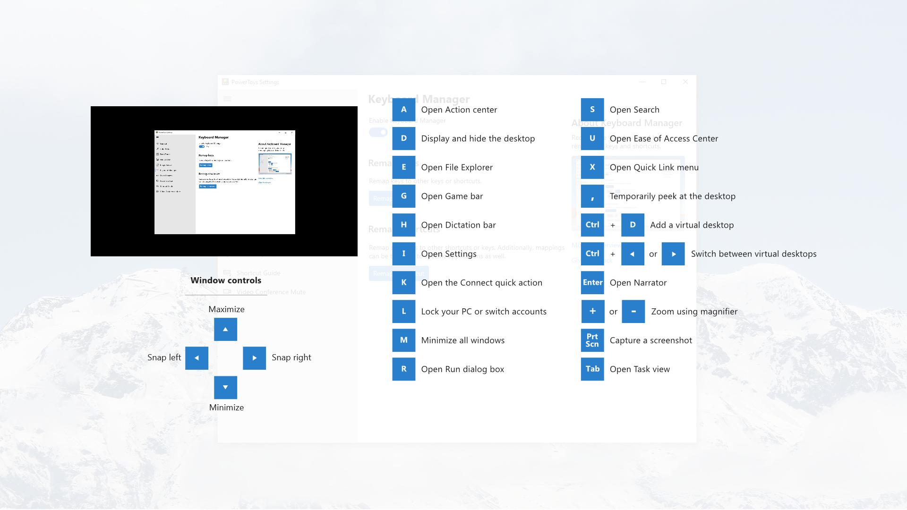
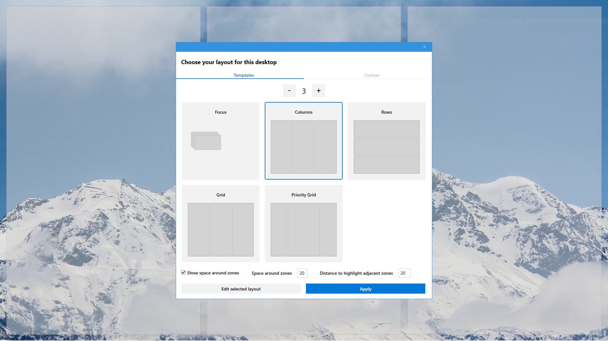
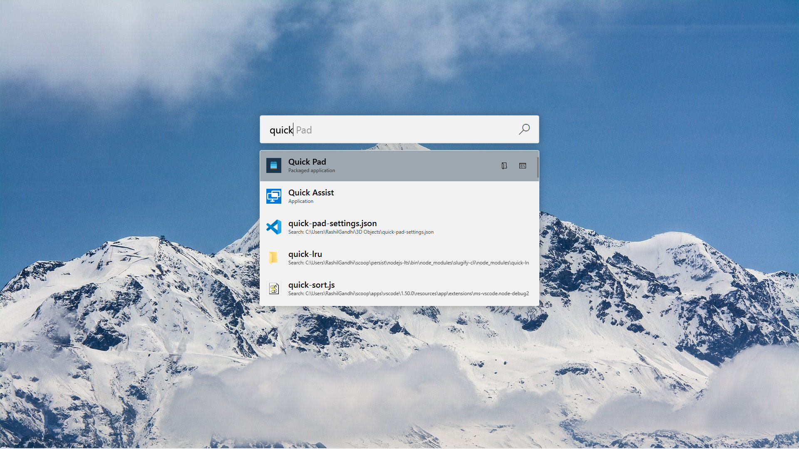

# Desktop

## Widgets

This can be made using [Rainmeter](https://www.rainmeter.net/), a desktop customization tool for Windows. This Reddit [thread](https://www.reddit.com/r/Rainmeter/comments/eva9on/my_take_in_minimalism/) explains how.

The taskbar icons are centered using [TaskbarX](https://chrisandriessen.nl/taskbarx).

If this is too much work, just press Windows key + G to open up the Game Bar to have a peek at the stats.

## Wallpapers

Windows Spotlight offers some unbelievably great looking wallpapers that refresh daily. However, curently Settings only provide the option to set the lockscreen as Spotlight wallpaper. Upcoming releases will have the option to set Spotlight as desktop backgrounds too. Meanwhile, [Spotlight Desktop](https://wallpaper.onlineth.com/) can be used to automatically synchronize desktop wallpaper with the Spotlight lockscreen in the background.

If you're better off just downloading some wallpapers, check out this awesome website that has thousands of eye-popping wallpapers: [WallpaperHub](https://wallpaperhub.app/). Microsoft Design also has its own [collection](https://wallpapers.microsoft.design/) of top notch and high quality wallpapers. Here's a peek at WallpaperHub:

## Theme and Colours

The system-wide theme can be switched from Settings.

Make sure to check the 'Choose accent colour automatically' option (it's not checked here for some reason) and the 'Transparency effects' option.

The theme can be automatically changed from Light to Dark and back to Light, depending on the time, using this nifty tool [Windows-Auto-Night-Mode](https://github.com/Armin2208/Windows-Auto-Night-Mode). It even changes the Office theme and applies custom `.theme` files if you have those.

## PowerToys

[PowerToys](https://github.com/microsoft/powertoys) by Microsoft is an awesome set of utilities designed to add useful little features to aid in daily usage. Here are some screenshots of the tools I use.

. | .
:-: | :-:
Main Settings | Shortcut Guide
 | 
Color Picker | Conference Mute
 | 
Fancy Zones | PT Run
 | 
