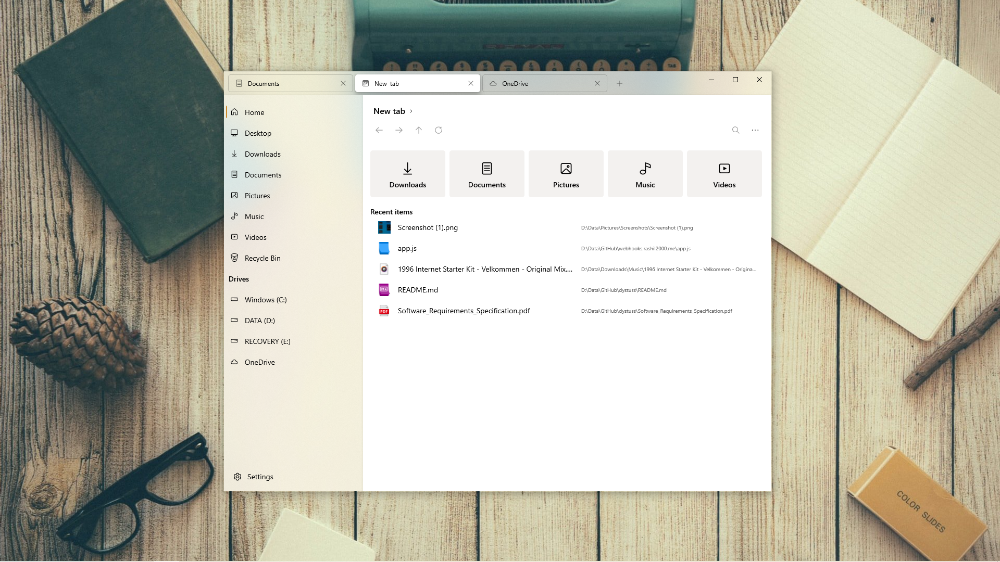
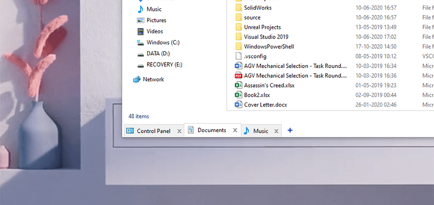
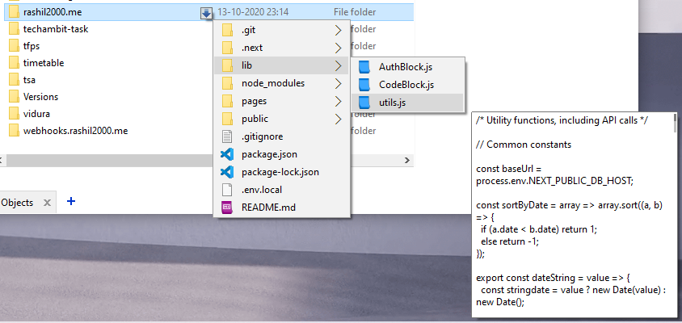
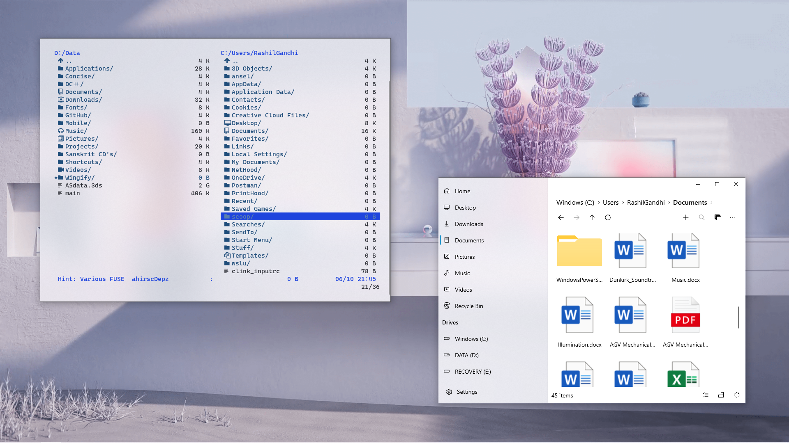
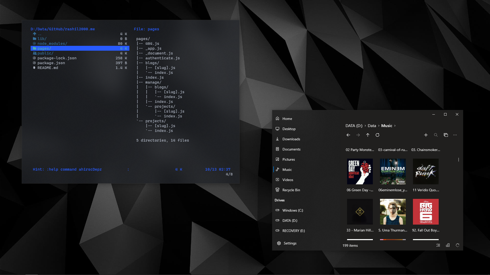

# Explorers

## Files

[Files](https://github.com/duke7553/files-uwp) is, in the authors' words, *an enthusiast take on what Windows Explorer should be*. It is the best-looking and most feature-rich modern alternative to Explorer currently.

It looks something like this in Light theme

And in Dark theme

## QTTabBar

[QTTabBar](http://qttabbar.wikidot.com/) is a set of shell extensions that add features like multiple tabs, command bars, preview panes, content tooltips etc. to the Windows Explorer. It is highly extensible and extremely helpful when managing a lot of files/folders simultaneously.

. | .
:-: | :-:
Multiple Tabs | Content Tooltips
 | 

## Vifm

[Vifm](https://vifm.info/) is a commandline file explorer with Vim keybindings, and is super useful for quickly looking up stuff when working in the terminal. I've included my personalised `vifmrc` here that adds icons and improves colors. Here are some screenshots, along with Files in vertical-flyout mode.

