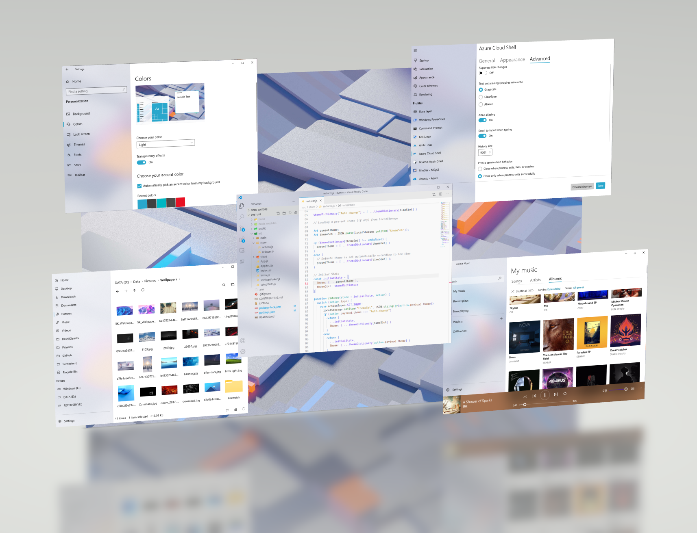

  <b>fluent-config</b>  
     
 <b>Configuration files and workflows</b>  
 Apps are organized into folders, which contain configuration files, screenshots, and a Readme explaining the use of each.  
 All apps are open source. I recommend using the <a href="https://scoop.sh">Scoop</a> package manager; it is super easy to use and has most of these apps.
   <small>The above screenshot was taken with Paint 3D. This Reddit <a href="https://www.reddit.com/r/Windows10/comments/la6y7j/supercharge_your_screenshots/">thread</a> explains it in super easy steps.</small>

