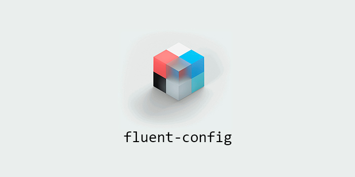

     
 <b>Configuration files and workflows</b>  
 Apps are organized into folders, which contain configuration files, screenshots, and a Readme explaining the use of each.  
 All apps are open source, and most of them can be installed through the <a href="https://scoop.sh">Scoop</a> package manager.

