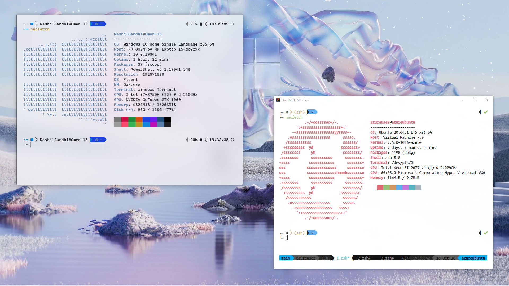
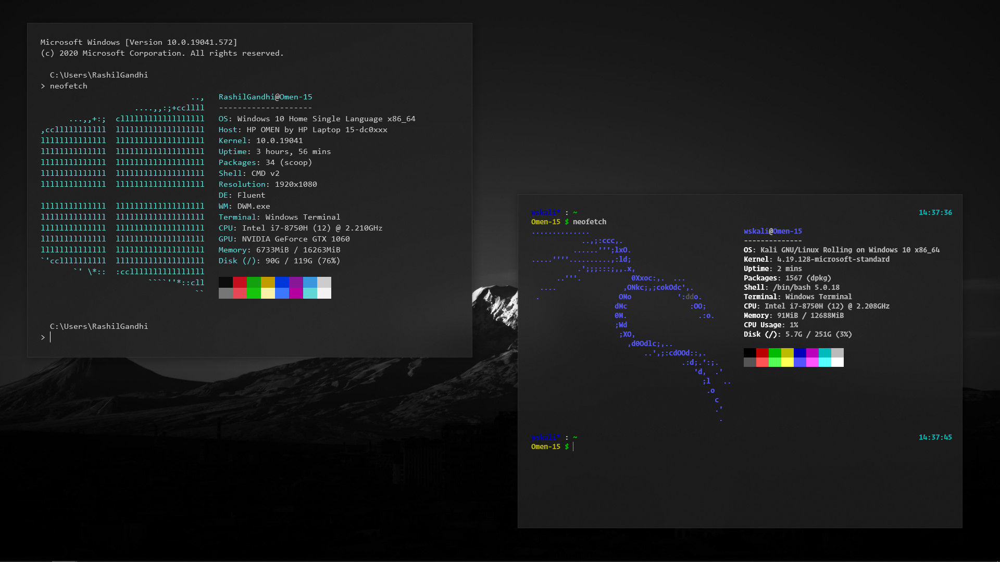

# Shells

This folder contains the following shell profile configurations:
- `Microsoft.PowerShell_profile.ps1` for Windows PowerShell and PowerShell Core.
- `clink_inputrc` for CMD.
- `.bashrc` for BASh.
- `.zshrc` for ZSh.
- `.tmux.conf` for TMux.

Here are the shells running on my system:

Windows PowerShell and a remote Ubuntu Server

Command Prompt and Kali on WSL

