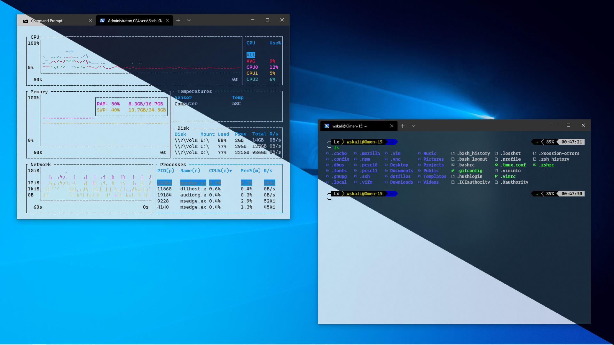
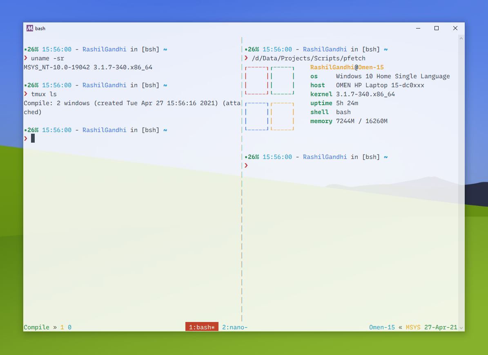

# Terminals

## Windows Terminal

[Windows Terminal](https://github.com/microsoft/terminal) is the official modern replacement for the aged ConHost. It is extremely feature rich and customizable.

Here's the terminal at work - both light and dark themes!

My configuration settings for Windows Terminal can be found in the `settings.json` file.

## MinTTY

[MinTTY](https://mintty.github.io) is the only feature-complete unix-like terminal for Windows, with full support for all pseudoconsole APIs, text-attributes etc. It is installed as a part of Cygwin, MSys or even Git. It aims to mimic Linux's xterm, so it's not the most modern-looking of terminals, but is extensively customizable and useful. Here's a screenshot of MinTTY running tmux, in MSys2.

Configuration file for MinTTY is called `.minttyrc`.